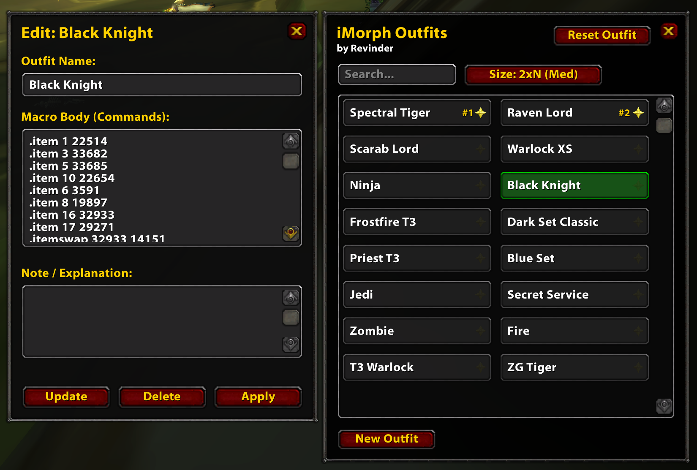

# iMorph Outfits

> [!WARNING]  
> This has been purely vibecoded for fun. No code has been reviewed, though the manual testing was conducted.

> [!TIP]
> **Download:** Grab the latest packaged build from the [Releases page](../../releases). Extract the `iMorphOutfits` folder into your `Interface/AddOns/` directory, then restart the game and enable the addon at the character select screen.

  

An elegant, grid-based wardrobe launcher and manager designed for tracking and executing iMorph profiles efficiently.

---

## Slash Commands

Access runtime tools directly using either **`/rev`** or **`/imo`**:

| Command | Description |
| --- | --- |
| `/rev` | Toggles the main wardrobe grid panel. |
| `/rev help` | Outputs the diagnostic command listing to the chat frame. |
| `/rev random` | Selects and executes one profile entirely at random. |
| `/rev favourite list` | Prints a numbered breakdown of all pinned favorite items. |
| `/rev favourite random` | Selects and executes a random profile strictly from your favorites. |
| `/rev favourite <number>` | Instantly fires the outfit associated with that favorite number block. |

---

## Usage Shortcuts

> **Left-Click Button:** Instantly route morph commands directly to the chat client engine.

> **Right-Click Button:** Open the pop-up configuration matrix modal to update labels, commands, or add text notes.

> **Star Button:** Toggle favorite pinning flags on the fly. Unstarred icons stay dim to keep your UI visually quiet.

---

## Importing & Exporting Outfits

Outfits are stored locally per-account in SavedVariables, which means they don't follow you to another machine or account automatically. The built-in Import/Export dialog lets you move your collection as a compact, shareable text string.

- **Export:** Opens a text box pre-filled with an encoded dump of all your current outfits. The text is auto-highlighted — just press `Ctrl+C` to copy it, then save it anywhere (a notes file, pastebin, DM to a friend, etc.).
- **Import:** Paste a previously exported string into the box with `Ctrl+V` and hit **Import**. Valid entries are merged into your wardrobe and the grid refreshes automatically; invalid or corrupted strings are rejected with an error so nothing gets clobbered.

This is handy for backing up your sets before tweaking things, transferring them between characters/accounts, or sharing a curated lookbook with other iMorph users.
